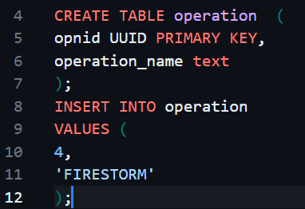

# regex-sql
Useful Regex patterns for editing SQL files.

EXAMPLE FORMAT 

``
CREATE TABLE operation  ( 
opnid UUID PRIMARY KEY,
operation_name text
);
``
``
INSERT INTO operation
VALUES (
4,
'FIRESTORM'
);
``

## CREATE TABLE
### Add PRIMARY KEY to first id column

``(CREATE TABLE) (.*?)(\()(\n.* )\b(bigint|text|n|numeric|boolean|timestamp)\b``

 
In your IDE, insert regex in find box then use replace all method with the following:
 
$0 PRIMARY KEY
 
You may add more data types in regex in between the \b()\b section. 

### Modify ID type to UUID 

``(CREATE TABLE) (.*?)(\()(\n)(\b\w*(id|key)\w*\b) (bigint|number|text|decimal)``

 
In your IDE, insert regex in find box then use replace all method with the following:
 
$1 $2 $3 $4$5 UUID
 
You may add more data types in regex in between the bigint | decimal section. 

## INSERT INTO 
### Modify first value of an insert statment. I chose to replace it with ``uuid_generate_v4()``

``(INSERT INTO) ("([^"]+)"|\b\w+\b)(\n)(VALUES) (\()(\n)([-+]?\b\d+\.\d+\b|\b\d+\b|\b\w+\b)``

 
In your IDE, insert regex in find box then use replace all method with the following:
 
$1 $2 $3 $4$5 $6 \nuuid_generate_v4()
 

### Match a specific line number. I chose line 5. Replace that line's contents with anything. Edit the last capturing group to include your last line.

``(INSERT INTO [^\n]+\nVALUES \()((?:[^\n]*\n){5})([1],)``
 
In your IDE, insert regex in find box then use replace all method with the following:
 
$1$2'uuid',
 

## CREATE TABLE | INSERT INTO | ALTER TABLE
### Remove tbl in front of table name and then lowercase following text.

``(\b(CREATE TABLE|INSERT INTO|ALTER TABLE)\b) (\b(tbl([a-zA-Z]*)\b))``

 
In your IDE, insert regex in find box then use replace all method with the following:
 
$1 \L$5,
 
